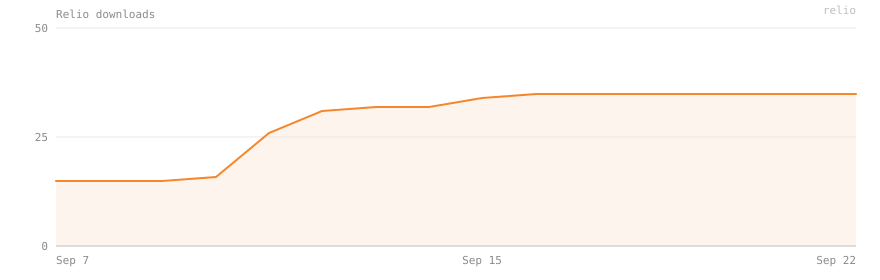
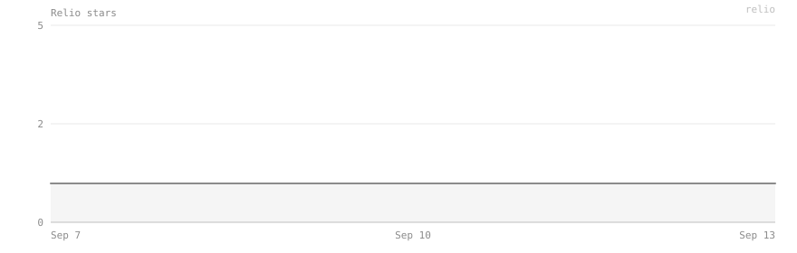

<!-- Hero image goes here. Drop a file at docs/hero.png (≈720px wide). -->
<p align="center">
  
</p>

<h1 align="center">Relio</h1>

<p align="center"><i>turn commits into releases</i></p>

<!--
  One badge identity: rounded "flat" pills, scaled up with height=28, charcoal
  label (labelColor=1c1c1c) + Relio orange (F5872B) across the board so the row
  reads as one Relio object. CI keeps shields' own pass/fail colour — a green
  check that can turn red is worth more than cohesion there.
-->
<p align="center">
  <a href="https://github.com/Soyagvs/relio/releases/latest"></a>
  <a href="https://github.com/Soyagvs/relio/releases"></a>
  <a href="https://github.com/Soyagvs/homebrew-tap"></a>
  <br>
  <a href="https://github.com/Soyagvs/relio/actions/workflows/ci.yml"></a>
  <a href="https://github.com/Soyagvs/relio/stargazers"></a>
  <a href="LICENSE"></a>
</p>

<p align="center"><sub>badges are cached by shields.io — <code>relio stats</code> prints the live numbers</sub></p>

<p align="center">
  
</p>

## Relio in one minute

You just finished a feature. Now comes the boring part: figure out the new
version number, write the changelog, tag the commit, remember the exact `git`
commands. Every time. By hand.

**Relio does that part for you.** It reads the commits you already wrote, works
out what the next version should be, drafts the changelog, and creates the tag —
and it shows you a **preview first**, so nothing changes until you say yes.

```
code  →  commit  →  push  →  relio  →  version + CHANGELOG.md + tag
```

Think of it as the assistant that fills in the release paperwork. You still
review and sign it.

<table>
<tr>
<td width="33%" valign="top">

**What it reads**

Your git history — the commits since your last tag, written as
[Conventional Commits](https://www.conventionalcommits.org/)
(`feat:`, `fix:`, …).

</td>
<td width="33%" valign="top">

**What it gives back**

A version number, a `CHANGELOG.md` section, and an annotated git tag — all
previewed before anything is written.

</td>
<td width="33%" valign="top">

**What leaves your machine**

Nothing, by default. Relio stops at the local tag and prints the `git push`.
Pushing and creating the GitHub Release is opt-in — `--publish`.

</td>
</tr>
</table>

> [!NOTE]
> Relio does **not** replace git or GitHub. It removes the repetitive work that
> happens *after* you finish coding, and it never sends data about you anywhere.

<p align="center">
  
</p>

<h3 align="center">Download History</h3>

<p align="center">
  
</p>

<p align="center"><sub>real snapshots, recorded daily into <a href=".github/stats/downloads.json"><code>.github/stats/downloads.json</code></a> — release-asset downloads, not unique installs</sub></p>

<div align="center">
<details>
<summary>Star history</summary>
<br>

</details>
</div>

<p align="center">
  
</p>

## Contents

- [Install](#install)
- [Quick start](#quick-start)
- [The interactive menu](#the-interactive-menu)
- [Commands](#commands)
  - [`relio`](#relio--create-a-release) · [`relio status`](#relio-status) · [`relio check`](#relio-check) · [`relio undo`](#relio-undo) · [`relio guide`](#relio-guide) · [`relio stats`](#relio-stats) · [`relio init`](#relio-init) · [`relio post`](#relio-post) · [`relio image`](#relio-image) · [`relio auth`](#relio-auth) · [`relio version`](#relio-version)
- [Global flags](#global-flags)
- [How the version is chosen](#how-the-version-is-chosen)
- [How the changelog is built](#how-the-changelog-is-built)
- [Publishing to GitHub](#publishing-to-github)
- [Syncing the version into project files](#syncing-the-version-into-project-files)
- [Release hooks](#release-hooks)
- [Configuration — `.release.yaml`](#configuration--releaseyaml)
- [Language](#language)
- [Non-interactive / CI usage](#non-interactive--ci-usage)
- [Project layout](#project-layout)
- [Roadmap](#roadmap)
- [Contributing](#contributing)
- [License](#license)

<p align="center">
  
</p>

## Install

Pick whichever line matches how you already install tools. All of them give you
the same `relio` binary.

> Every version and its binaries: **[github.com/soyagvs/relio/releases](https://github.com/soyagvs/relio/releases)**

### Homebrew (macOS / Linux) — recommended

```bash
brew install soyagvs/tap/relio
```

`brew upgrade relio` picks up new releases. The formula downloads the official
prebuilt binaries from this repo's [GitHub Releases](https://github.com/soyagvs/relio/releases)
— it does not build from source.

### Manual — from GitHub Releases

Grab the archive for your platform from the
[latest release](https://github.com/soyagvs/relio/releases/latest), check it
against `checksums.txt`, and drop the binary on your `PATH`:

```bash
VER=1.5.0                      # the release you want
OS=darwin; ARCH=arm64          # darwin|linux|windows  +  amd64|arm64
curl -fsSLO "https://github.com/soyagvs/relio/releases/download/v${VER}/relio_${VER}_${OS}_${ARCH}.tar.gz"
curl -fsSLO "https://github.com/soyagvs/relio/releases/download/v${VER}/checksums.txt"
sha256sum -c --ignore-missing checksums.txt
tar -xzf "relio_${VER}_${OS}_${ARCH}.tar.gz" relio
sudo mv relio /usr/local/bin/
```

Windows: download `relio_<ver>_windows_amd64.zip` and put `relio.exe` on your
`PATH`.

### With Go

```bash
go install github.com/soyagvs/relio@latest   # -> $GOBIN / $GOPATH/bin
```

### From source

```bash
git clone https://github.com/soyagvs/relio
cd relio
go build -o relio .          # ./relio
# or: make install           # builds to ~/.cargo/bin/relio
```

Building requires **Go 1.22+**. At runtime Relio needs the `git` binary on
`PATH`.

<p align="center">
  
</p>

## Quick start

Two commands, run inside the project you want to release:

```bash
cd your-project
relio init        # writes .release.yaml (configuration only, never secrets)
relio             # opens the interactive menu
```

Pick **Release**, read the preview, confirm. Relio then:

1. updates `CHANGELOG.md`,
2. commits that file as `chore(release): vX.Y.Z`,
3. creates an annotated git tag on that commit,
4. prints the exact `git push` for you to run.

> [!WARNING]
> **Nothing is pushed for you** by default. Relio stops at the tag and tells you
> the push command. You stay in control of what reaches the remote — opt in with
> `--publish` (or the menu's Release entry) when you want Relio to push and
> create the GitHub Release too.

<p align="center">
  
</p>

## The interactive menu

Running `relio` with no arguments in a terminal opens a one-shot menu — it runs
**one action and exits**, so the result stays on screen. Run `relio` again for
another action.

```
  RELIO menu

  1  Release          Create a release — final or rc, and optionally push + publish
  2  Status           What's unreleased and the version it suggests
  3  Check            Which commits since the last tag are Conventional Commits
  4  Releases         Browse versions, read notes, delete one
  5  Announcement     Copy-paste release text — pick a format
  6  Release image    Save or share a PNG release card
  7  Auth             GitHub connection — status and how to link
  8  Setup            Create or inspect .release.yaml
  9  Settings         Language and release-footer preferences
     Guide            Step-by-step walkthrough of the whole flow
     Help             Every command and flag
     Exit             Leave Relio

  ↑/↓ move · 1–9 jump · ? help · g guide · enter select · q quit
```

| Key | Does |
| --- | ---- |
| `↑` / `↓` | move the cursor |
| `1`–`9` | jump straight to that row and select it (the first nine rows only — **Guide**, **Help**, and **Exit** are arrow-only) |
| `?` | open **Help** |
| `g` | open the **Guide** |
| `enter` | run the highlighted row |
| `q` | quit |

A few rows do more than run a flagless command:

- **Release** asks three quick questions — *final release or release candidate*,
  *tag locally or push + publish*, and *whether to edit the notes first* — so you
  never have to remember `--rc`, `--publish`, or `--edit`. Then it runs the
  normal preview + wizard.
- **Auth** shows which GitHub token Relio found and who it belongs to, or
  explains how to connect one.
- **Setup** runs `relio init` (or tells you the config already exists).

The design intent, in one line: **anything the flags can do, the menu can do.**
The flags are the scripting surface; the menu is the interactive one.

The menu is skipped — and a release runs directly — when the output is not a
terminal (CI, a pipe), or when you pass `-y` / `--yes`, or a forced bump
(`--patch` / `--minor` / `--major`). `--rc` and `--publish` on their own still
open the menu; combine them with `--yes` to act without prompts.

The banner shows the current version, and — when a newer Relio has been
published — `▲ vX.Y.Z available` right below it. The check reads one cached value
on disk and, at most once a day, refreshes it in the background; it never blocks
the menu or sends anything about you. `relio version` shows the same hint. Set
`RELIO_NO_UPDATE_CHECK=1` (or run in CI) to turn it off.

<p align="center">
  
</p>

## Commands

### `relio` — create a release

With no subcommand, `relio` builds a **release plan** from the commits since the
last tag and applies it.

1. Find the latest tag (`git describe --tags --abbrev=0`); if there is none,
   start from `v0.0.0`.
2. Read `<tag>..HEAD`, parse each commit as a Conventional Commit.
3. Decide the next version (see [below](#how-the-version-is-chosen)).
4. Show the preview — **nothing is written yet**:

   ```
   ⬢ Relio  v1.5.0  ·  azeink

   ╭──────────────────────────╮
   │  Current version v1.3.2  │
   │  Detected change minor   │
   │  Next version    v1.4.0  │
   ╰──────────────────────────╯

   Added
     a967103  Add transaction categories
   Fixed
     92af81e  Dashboard crash on empty state

   3 commits since v1.3.2
   ```

5. In a terminal you get a small wizard: **Create**, change the bump
   (patch / minor / major), or cancel. With `--yes` it applies immediately.
6. On confirm:

   ```
   ✓ CHANGELOG.md updated
   ✓ CHANGELOG.md committed
   ✓ git tag v1.4.0 created
   ✓ release ready

     next:  git push && git push origin v1.4.0
   ```

`CHANGELOG.md` gets a new `## [x.y.z] - YYYY-MM-DD` section at the top of the
release history, in the [Keep a Changelog](https://keepachangelog.com/) format.
It is committed on its own as `chore(release): vX.Y.Z` — together with any
[version files](#syncing-the-version-into-project-files) you configured, and
nothing else in the work tree — and the **annotated** git tag is created on that
commit, so the tag always carries its own changelog section. With `--no-tag` the
changelog is written but not committed, leaving the commit and tag to you.

Each section can also carry a `Thanks to …` credits line and a GitHub compare
link — both off by default. While they are, `relio` prints a one-line reminder
after the release; see [Contributors and a compare link](#contributors-and-a-compare-link)
to turn them on.

| Flag | Meaning |
| ---- | ------- |
| `--patch` `--minor` `--major` | Force the bump instead of inferring it from the commits (one at a time). |
| `-y, --yes` | Skip the menu and the confirmation. Required in CI / a non-interactive shell. |
| `--no-changelog` | Do not touch the changelog file. |
| `--no-tag` | Do not commit the release files or create the git tag. |
| `--no-version-files` | Skip the `release.version_files` sync for this run. See [Syncing the version into project files](#syncing-the-version-into-project-files). |
| `--publish` | After tagging, push the branch and tag to `origin` and create the GitHub Release. See [Publishing to GitHub](#publishing-to-github). |
| `--rc` | Cut a release candidate (`vX.Y.Z-rc.N`) instead of the final version. See [Pre-releases](#pre-releases). |
| `--no-hooks` | Skip the `before` / `after` hooks from `.release.yaml` for this run. See [Release hooks](#release-hooks). |
| `--edit` | Open the generated release notes in your editor before anything is written. Interactive terminals only. |

`--edit` opens `$RELIO_EDITOR` / `$VISUAL` / `$EDITOR` (falling back to `vi`) on
the generated notes body once you have confirmed the plan. Save your version to
use it, or save an empty or unchanged buffer to keep the generated notes. The
edited text lands verbatim in both `CHANGELOG.md` and the GitHub Release body.
The `## [x.y.z]` heading is not editable — only the body.

```bash
relio                     # interactive
relio --yes               # apply the inferred bump, no prompts
relio --minor --yes       # force a minor bump
relio --no-tag            # write the changelog only
relio --yes --publish     # also push and create the GitHub Release
relio --rc --yes          # cut the next release candidate
relio --yes --no-hooks    # skip the .release.yaml hooks for this run
relio --edit --yes        # confirm nothing, but hand-edit the notes
```

---

### `relio status`

A read-only glance at what's unreleased and the version it suggests. No prompts,
safe to run anywhere.

```
$ relio status

azeink

Current      v1.4.0
Unreleased   6 commits

feat      3
fix       2
refactor  1

Suggested    v1.5.0  (minor)

! uncommitted changes in the working tree
Ready to release.
```

When there are no new commits: `Suggested —` and `Nothing to release.`
Also available as the **Status** menu entry.

When the current version is a pre-release, `status` adds one hint line under the
`Suggested` row:

```
on a pre-release — `relio` finalizes v1.6.0, `relio --rc` cuts the next rc
```

---

### `relio check`

Read-only lint of the commits since the last tag: how many are
[Conventional Commits](https://www.conventionalcommits.org/), which are not, and
the bump they add up to. No prompts, no writes, safe anywhere.

```
$ relio check

azeink

8 commits since v1.5.0
  ✓ 5 conventional
  ✗ 3 not conventional:
      a1b2c3d  add login screen
      d4e5f6a  dashboard fix
      f7g8h9i  wip

Detected bump: minor  →  v1.6.0
```

When every commit is conventional the `✗` block is dropped. With no commits since
the tag it prints `Nothing to check …` and exits 0.

| Flag | Meaning |
| ---- | ------- |
| `--strict` | Exit non-zero when at least one commit since the tag is not a Conventional Commit. Use it as a pre-release CI gate. |

Also available as the **Check** menu entry.

---

### `relio undo`

Reverse the release you just cut — the tag, and the `chore(release):` commit that
carries the changelog and any version-file bumps. It only works while the release
is still local: it never touches a remote, and it is not the way to walk back
something you have already pushed.

```
$ relio undo

Undo v1.6.0
  · delete the local tag v1.6.0
  · remove the `chore(release): v1.6.0` commit (git reset --hard HEAD~1)
    CHANGELOG.md and any version files return to their previous state

  Proceed? [y/N] y
✓ deleted tag v1.6.0
✓ removed the release commit
```

With no tags yet it prints `No tags yet …` and exits 0. It refuses in two cases:
when the latest tag no longer points at `HEAD` (you have committed since the
release, so there is nothing safe to unwind), and when `HEAD` is already on a
remote branch — undoing then would rewrite shared history, so it tells you to
delete the tag on the remote yourself and drop the GitHub Release by hand.

| Flag | Meaning |
| ---- | ------- |
| `-y`, `--yes` | Skip the confirmation prompt. |
| `--force` | Undo even when the working tree is dirty. `git reset --hard` discards those uncommitted changes, so use it deliberately. |

`--no-tag` runs and GitHub Releases are out of scope: if you released without a
tag, or want a published Release gone, do that step by hand.

---

### `relio guide`

A step-by-step walkthrough of the whole flow, for when you are meeting Relio for
the first time: `relio init` → writing Conventional Commits → `relio status` →
`relio` → pushing or `--publish` → the optional extras (`post`, `image`,
`version_files`, hooks).

In a terminal it is an interactive stepper — `enter` to move on, `←` to go back,
`q` to leave — and on the steps where it helps it offers to **run the command
for you**: `relio init` when there is no `.release.yaml` yet, and `relio check` /
`relio status` once there is one. Piped or redirected, it prints the same eight
steps as plain text.

```bash
relio guide          # interactive in a TTY, plain text when piped
```

Also reachable as the **Guide** menu entry, or by pressing `g` anywhere in the
menu.

---

### `relio stats`

Relio's **public** distribution numbers, read straight from the GitHub REST API
— release-asset download counts, per-release and per-platform breakdowns, stars
and forks.

```
$ relio stats

Relio -- stats

Downloads
  total               1,284
  latest release        437

Releases
  v1.2.0                437
  v1.1.0                521
  v1.0.0                326

Latest release (v1.2.0)
  macOS arm64           291
  macOS amd64            38
  Linux amd64            82
  Linux arm64            26

GitHub
  stars                126
  forks                 14

downloads = release-asset downloads, not unique users or installs
```

- **No telemetry.** Relio records nothing — no runs, commands, repos, or user
  data. `relio stats` only makes `GET` requests to `api.github.com`.
- **"Downloads" = release-asset downloads.** Each time someone downloads a
  binary archive from a GitHub Release it counts once. It is **not** a count of
  unique users or active installs. `checksums.txt` is excluded.
- Works **without authentication**. If you hit the API rate limit, set
  `GITHUB_TOKEN` (or `GH_TOKEN`) in your environment to raise it — the token is
  only sent to GitHub, never stored.
- `--repo owner/name` queries a different repository (defaults to
  `soyagvs/relio`). `--prerelease` includes pre-releases in the list.

---

### `relio init`

Writes `.release.yaml` at the repository root with sensible defaults. The file
holds **configuration only** — credentials never go in it. Refuses to overwrite
an existing file.

| Flag | Meaning |
| ---- | ------- |
| `--project` | Project name. Defaults to the `origin` remote's repo name, else the directory name. |

```bash
relio init
relio init --project azeink
```

Also the **Setup** menu entry, which prompts for the project name.

---

### `relio post`

Generates a short, plain-text announcement from the commits since the last tag.
**Only the text goes to stdout**, so `relio post | pbcopy` (or `| wl-copy`)
copies it cleanly. Colour is added when stdout is a terminal and stripped when
it is piped.

| `--format` | Output |
| ---------- | ------ |
| `minimal` *(default)* | Byte-identical to what the **Releases** browser prints for a version: `relio -- release`, `<project> · <version>`, `<date> · <time> · N commits`, then the grouped notes. |
| `social` | Shortest. `Project -- Release`, then `version · DD.MM.YY · HH:MM`, then one `<type>  <description>` line per **notable** commit (`feat`, `fix`, `perf`, `refactor`, `revert`, `style`). |
| `technical` | Terse `•` bullet list — good for a changelog or a dev channel. |
| `casual` | Loose tone: `proj v1.4.0 is out. → …` |
| `changelog` | The exact section that goes into `CHANGELOG.md`. |

```
$ relio post --format social
Azeink -- Release

v1.4.0 · 06.09.26 · 14:36

feat      Add facial attendance
feat      Add new kiosk interface
refactor  Authentication flow
fix       Supervisor login
```

*(This is a preview of the content generator — nothing is published.)* Also the
**Announcement** menu entry.

---

### `relio image`

Renders a dark, developer-styled **release card**. Everything on it comes from
the real release. In a terminal it prompts for the release, the shape, the
colour, and then **what to do with the image**:

- **Save + download link** — write `relio-<version>-<shape>.png` to the current
  directory *and* upload it for a link + QR.
- **Save only** — just write the file.
- **Download link only** — upload it for a link + QR, write nothing to disk.

The flags below skip those prompts. With no TTY and no flags it just saves the
PNG to the current directory (latest tag / horizontal / orange).

| Flag | Values |
| ---- | ------ |
| `--version` | Release tag to render. Default: the latest tag. |
| `--shape` | `horizontal` (1200×630, Twitter/OG) · `vertical` (1080×1920, Instagram story) · `square` (1080×1080). Each has its **own** responsive layout, not a crop. |
| `--theme` | Accent colour: `orange` *(default)* · `green` · `purple`. The section colours (Added / Changed / Fixed) are fixed. |
| `--hash` | Prefix each line with its short commit hash. Off by default. |
| `--upload` | Save the PNG **and** upload it to a temporary public host (litterbox, 72h; catbox as fallback), printing the URL **plus a QR code**. Handy for getting it onto a phone over `mosh` — only text crosses the wire. |
| `--link-only` | Upload for the URL + QR **without** writing a file to disk. |

```bash
relio image                                   # prompts for everything
relio image --shape square --theme green
relio image --version v1.4.0 --shape vertical --upload
relio image --link-only                        # just give me the link
```

If a changelog line is long it wraps onto the next line; if there are too many
commits for the card, each section is capped and a `+ N more` line is added — it
never spills outside the card, on any shape.

The **Releases** menu entry opens a browser of every tag:

```
↑/↓  move between versions        (the pane shows that version's notes)
enter  print the selected version's notes to the terminal and exit
d      delete the version — removes the git tag AND its CHANGELOG.md section (y/N)
q      back
```

---

### `relio auth`

Relio talks to GitHub with a **personal access token you already have**, not a
login of its own. It checks `RELIO_GITHUB_TOKEN`, `GITHUB_TOKEN` and `GH_TOKEN`
in that order, then falls back to `gh auth token` when the
[GitHub CLI](https://cli.github.com/) is signed in. The token is only ever sent
to `api.github.com` in the `Authorization` header — nothing is written to disk.

```
$ relio auth status
· logged in as octocat (via GITHUB_TOKEN)
```

`relio auth status` resolves the token, calls `GET /user`, and prints who it
belongs to and which source it came from — or `not authenticated` when none is
found. It is the same check as the **Auth** menu entry.

There is no `login` or `logout` of Relio's own. `relio auth login` and
`relio auth logout` just print the one-liners:

- **connect** — set `GITHUB_TOKEN` (or `RELIO_GITHUB_TOKEN` / `GH_TOKEN`) to a
  PAT with `repo` scope, or run `gh auth login`.
- **disconnect** — unset those variables, or run `gh auth logout`.

A per-user browser sign-in (OAuth Device Flow) with OS-keychain storage is on
the [roadmap](#roadmap).

---

### `relio version`

```
$ relio version
Relio v1.5.0 (commit a1b2c3d, built 2026-09-07)
```

The version is `dev` unless the binary was built with `HEAD` exactly on a tag
(that's what `make install` does), or with
`-ldflags "-X github.com/soyagvs/relio/cmd.version=…"` (that's what the official
release build does). It also carries the same `▲ vX.Y.Z available` hint as the
menu.

<p align="center">
  
</p>

## Global flags

Available on every command:

| Flag | Meaning |
| ---- | ------- |
| `-C, --dir <path>` | Run as if Relio was started in `<path>`. |
| `--no-hash` | Hide the commit hash on each release-note line (preview, Releases browser, `post`, `check`). |

<p align="center">
  
</p>

## How the version is chosen

A version looks like `MAJOR.MINOR.PATCH` (for example `1.4.0`). The idea behind
[SemVer](https://semver.org/) is simple: the number tells the next person **how
risky the upgrade is**.

| Part change | Means | Example |
| ----------- | ----- | ------- |
| **MAJOR** | something you relied on changed or was removed — read the notes before upgrading | `1.3.2 → 2.0.0` |
| **MINOR** | new things were added, old things still work | `1.3.2 → 1.4.0` |
| **PATCH** | bug fixes only, safe to take | `1.3.2 → 1.3.3` |

Relio reads the commits since the last tag and picks the bump for you:

| Commits found | Bump | Example |
| ------------- | ---- | ------- |
| a `feat!:` or a `BREAKING CHANGE:` footer | **MAJOR** | `1.3.2 → 2.0.0` |
| any `feat:` (and no breaking change) | **MINOR** | `1.3.2 → 1.4.0` |
| any `fix:` / `perf:` / `refactor:` | **PATCH** | `1.3.2 → 1.3.3` |
| commits, but no conventional signal | **PATCH** | `1.3.2 → 1.3.3` |
| no commits since the last tag | — | *nothing to release* |

`--patch` / `--minor` / `--major` override the inference; the wizard's
"Change to…" options do the same interactively.

> [!TIP]
> Pre-1.0 (`0.x.y`): the API is not stable yet, so breaking changes inside a
> MINOR are conventionally acceptable — Relio still bumps MAJOR if you ask it to.

### Pre-releases

A **release candidate** lets you cut `v1.6.0-rc.1`, hand it to testers, iterate,
and only then ship `v1.6.0` — without inventing throwaway version numbers.

`relio --rc` targets a candidate instead of the final version. Because a bare
`relio` in a terminal always opens the menu, use `relio --rc --yes` to cut one
non-interactively, or pick **Release → Release candidate** in the menu. The
typical flow:

1. On stable `v1.5.0` with a `feat:` since, `relio --rc` cuts **`v1.6.0-rc.1`**
   — the version the commits imply, with `-rc.1` appended.
2. More commits land — run it again and the counter advances:
   **`v1.6.0-rc.2`** (same core version, `rc.1` → `rc.2`).
3. Ready to ship — `relio` with **no `--rc`** on an rc *finalizes* it:
   `v1.6.0-rc.2` → **`v1.6.0`**. The final `v1.6.0` changelog section summarises
   the **whole span since the last stable tag** — every commit across `rc.1`,
   `rc.2`, and anything after.
4. If a commit since the last rc escalates the target (a `feat!`, say),
   `relio --rc` moves the core up and restarts the counter: **`v2.0.0-rc.1`**.

`relio status` prints a hint line whenever `HEAD` is on a pre-release, telling
you the finalize version and the next-rc command.

The pre-release value carries all the way through: the git tag, the changelog
section heading, and any [version files](#syncing-the-version-into-project-files).

```bash
relio --rc --yes     # cut / advance the release candidate
relio --yes          # finalize the current rc to its stable core
```

When you [publish](#publishing-to-github) an rc, GoReleaser already does the
right thing: `.goreleaser.yaml` carries `prerelease: auto` (marks a `-` tag as a
GitHub pre-release) and `skip_upload: auto` (skips the Homebrew tap bump) — no
config change needed.

<p align="center">
  
</p>

## How the changelog is built

Each commit's Conventional Commit **type** maps to a Keep-a-Changelog section:

| Commit type | Changelog section |
| ----------- | ----------------- |
| `feat` | **Added** |
| `fix` | **Fixed** |
| `perf`, `refactor`, `revert`, `style` | **Changed** |
| `docs`, `chore`, `test`, `build`, `ci`, unknown | *left out of the changelog* |

A `BREAKING CHANGE:` footer or a `!` before the colon also adds the line to
**Changed**, prefixed with `**Breaking:**`. The scope, if any, is kept:
`fix(kiosk): header alignment` → `- kiosk: Header alignment`.

Run `relio --edit` to hand-edit the result before it is written. Relio opens
`$RELIO_EDITOR` / `$VISUAL` / `$EDITOR` (falling back to `vi`) on the generated
notes body — everything under the `## [x.y.z] - date` heading. Save your changes
to use them, or save an empty or unchanged buffer to keep the generated notes.
The edited text is written verbatim to `CHANGELOG.md` (under a freshly rendered
heading) and used as the GitHub Release body. The heading itself is not editable.
The optional footer described below is added after your edited notes, not shown
in the editor.

### Contributors and a compare link

Two opt-in toggles under `release:` add a trailing block to every changelog
section. `contributors: true` appends a line such as `Thanks to Alice, Bob.`,
built from the `git log` author names of the commits in the release range, in
first-seen order, with any name ending in `[bot]` filtered out — these are git
author names, not GitHub `@handles`. `compare_link: true` appends
`**Full changelog**: https://github.com/owner/repo/compare/v1.5.0...v1.6.0`.

Both lines also land in the GitHub Release body. The compare link needs a
GitHub `origin` remote (or an explicit `github.repo`) to resolve `owner/repo`,
and a previous tag to compare against, so it is skipped on the first release.
When both toggles are off, or neither line can be built, no footer is added.

While both are off, a `relio` release ends with a dimmed one-line reminder that
these toggles exist, so the feature stays discoverable without reading the docs.
The reminder disappears once either toggle is set.

<p align="center">
  
</p>

## Publishing to GitHub

By default Relio stops at the local tag. Getting that release onto GitHub then
means `git push`, a trip to the Releases page, and pasting the notes in by hand.
`--publish` does all of it in the same run.

### How it works

Turn it on per run with `--publish`, or always with `github.release: true` in
`.release.yaml`. Once the local tag exists, Relio:

1. pushes the current branch to `origin`,
2. pushes the new tag to `origin`,
3. creates a GitHub Release for that tag, using the new changelog section (its
   `## […]` heading stripped) as the body. A `-` in the tag marks the Release as
   a **pre-release**.

The target repo comes from `github.repo` (`owner/name`) when you set it,
otherwise it is read from the `origin` remote — which must be a `github.com`
remote.

**Auth is a token you already have.** Relio checks, in order:
`RELIO_GITHUB_TOKEN`, `GITHUB_TOKEN`, `GH_TOKEN`, then `gh auth token` when the
GitHub CLI is signed in. The token needs `repo` scope. There is **no OAuth app,
no browser flow, and nothing stored by Relio** — the token only travels to
`api.github.com` in the `Authorization` header.

In a terminal Relio asks before it pushes:

```
Push main and v1.6.0 to origin and publish the GitHub Release? [y/N]
```

With `--yes` it does not ask. If there is **no token**, or you **decline** the
prompt, Relio prints the `git push` commands and stops — the local tag is
untouched. If a Release **already exists** for the tag, Relio leaves it alone and
says so.

### Example

```bash
export GITHUB_TOKEN=ghp_xxxxxxxx     # or: gh auth login
relio --yes --publish
```

```
✓ CHANGELOG.md updated
✓ CHANGELOG.md committed
✓ git tag v1.6.0 created
✓ release ready

✓ pushed to origin
✓ GitHub Release v1.6.0 published
  https://github.com/you/project/releases/tag/v1.6.0
```

> [!NOTE]
> **Maintaining Relio itself?** GoReleaser in CI still does the heavier job on a
> tag push — cross-platform binaries, `checksums.txt`, the Homebrew tap bump (see
> [Non-interactive / CI usage](#non-interactive--ci-usage)). `--publish` is the
> lightweight path for projects that have no such pipeline.

<p align="center">
  
</p>

## Syncing the version into project files

Plenty of projects keep the version in more than one place — `package.json`,
`pyproject.toml`, a `VERSION` file. List those files under
`release.version_files` and Relio rewrites each one with the new version **in the
same `chore(release): vX.Y.Z` commit** as the changelog, so the tag points at a
commit where everything agrees.

```yaml
release:
    version_files:
        - package.json                       # known filename — built-in rule
        - VERSION                             # whole-file version token
        - Cargo.toml                          # first `version = "…"` line
        - { path: src/app/__init__.py, pattern: '__version__ = "([^"]+)"' }
```

**Known filenames need no pattern:**

| File | Rule |
| ---- | ---- |
| `package.json` | the `"version": "…"` value |
| `Cargo.toml`, `pyproject.toml`, any `*.toml` | the first `^version = "…"` line |
| `VERSION`, `version.txt` | the file's lone version token |

**Anything else** takes a `{ path, pattern }` entry whose `pattern` is a Go
regexp with **exactly one capture group** wrapping the version substring.

The value written is the **bare number**, no leading `v` (`1.6.0`). Replacement
is regex-based — Relio swaps the matched span and leaves every other byte
(indentation, key order, trailing newline) untouched; it never reformats the
file. A file already at the target version is a no-op.

A **missing file** or a **pattern that does not match** fails the run *before
anything is written*. Pass `--no-version-files` to skip the whole step for one
run.

<p align="center">
  
</p>

## Release hooks

Run your own shell commands around a release by listing them under
`release.hooks` — a smoke test before, a notification after, whatever the
project needs.

```yaml
release:
    hooks:
        before: make test                       # one command…
        after:                                   # …or a list, run in order
            - ./scripts/changelog-to-slack.sh
            - echo "shipped $RELIO_TAG"
```

Each hook is a single shell command string, or a list of them. A list stops at
the first command that exits non-zero.

| Hook | Runs | A non-zero exit… |
| ---- | ---- | ---------------- |
| **`before`** | after you confirm the release, before *anything* is written | **aborts** the release — no changelog, no commit, no tag — and `relio` exits non-zero |
| **`after`** | at the very end: after the tag, and after the `--publish` push + GitHub Release when that ran | prints a **warning** only; `relio` still exits 0, because the release already happened |

Hooks run through the platform shell (`sh -c` on Unix, `cmd /c` on Windows) with
the **repository root** as the working directory. Output is streamed straight
through. They inherit the process environment plus three extra variables:

| Variable | Example | Meaning |
| -------- | ------- | ------- |
| `RELIO_VERSION` | `1.6.0` | the new version, no `v` |
| `RELIO_TAG` | `v1.6.0` | the new tag, honouring `tag_prefix` |
| `RELIO_PREVIOUS_TAG` | `v1.5.0` | the tag the release was computed from (empty on a first release) |

Pass `--no-hooks` to skip every hook for one run. `--yes` does **not** skip
hooks — CI needs them to run. Hooks never run for `relio status` or `relio check`
(they apply nothing).

<p align="center">
  
</p>

## Configuration — `.release.yaml`

Written by `relio init`, read from the repository root. **Configuration only —
no secrets.** A minimal file with just `project:` works; every field below falls
back to the default shown.

```yaml
# .release.yaml — safe to commit. Never put secrets or tokens here.

project: azeink            # free text — shown on cards, posts, and the banner
versioning: semver         # only "semver" is supported
commits: conventional      # only "conventional" is supported
language: ""               # "" = inherit the global preference; "en" / "es" to pin this repo

release:
    # changelog: and tag: are omit-default-true — leave them out to keep both
    # on; set either to false to turn that step off.
    changelog: true                 # write the changelog section on release
    changelog_file: CHANGELOG.md    # which file to write
    tag: true                       # commit the release files and create the git tag
    tag_prefix: v                   # "" for bare 1.6.0 tags instead of v1.6.0
    compare_link: false             # append a GitHub compare link to each changelog section
    contributors: false             # append a "Thanks to …" line built from commit authors

    # Files to rewrite with the new version, in the chore(release) commit.
    # A bare filename uses a built-in rule; a {path, pattern} entry gives an
    # explicit Go regexp with exactly one capture group around the version.
    version_files:
        - package.json
        - Cargo.toml
        - VERSION
        - { path: src/app/__init__.py, pattern: '__version__ = "([^"]+)"' }

    # Shell commands run around a release. `before` can abort it; `after` only warns.
    hooks:
        before: make test                   # a string, or a list run in order
        after:
            - ./scripts/notify.sh
            - echo "shipped $RELIO_TAG"

github:
    enabled: false         # reserved — not read yet
    repo: ""               # "owner/name" to publish to; empty = derive from origin
    release: false         # true = every `relio` also publishes the GitHub Release (same as --publish)

content:
    enabled: false         # reserved for the content generator (`relio post`)
```

Unknown `versioning` / `commits` values are rejected with a clear error. `omit
version_files` and `hooks` entirely if you don't use them — they carry no
defaults.

<p align="center">
  
</p>

## Language

Relio's interactive screens, `--help`, and command output can run in English or
Español. Pick a language from the menu's **Settings** entry (`relio` → `9`) — it
applies immediately and is saved for next time. There is no flag; the language
is resolved once, before any command runs:

1. `.release.yaml`'s `language:` key at the repository root, if set (per-repo
   override — currently edit this file by hand, there's no UI writer for it yet)
2. the global preference saved by the Settings screen
3. `en`, if neither is set

The global preference lives outside any repository, in a small `config.yaml`
Relio manages for you:

| OS | Path |
| --- | ---- |
| Linux | `$XDG_CONFIG_HOME/relio/config.yaml` (falls back to `~/.config/relio/config.yaml`) |
| macOS | `~/Library/Application Support/relio/config.yaml` |
| Windows | `%AppData%\relio\config.yaml` |

A missing or unreadable file is never an error — Relio just runs in English.
Content Relio writes to disk — `CHANGELOG.md` sections, GitHub Release bodies,
and `relio post` output — always stays in English regardless of the UI
language, so generated artifacts read consistently for every audience.

Translation coverage grows over time; any string not yet translated for a
language falls back to its English text rather than showing a raw key.

<p align="center">
  
</p>

## Non-interactive / CI usage

Relio detects a non-TTY and behaves predictably — the menu and every prompt are
skipped, and a bare `relio` without `--yes` refuses to touch the repo.

```bash
relio --yes                          # infer + apply, no prompts
relio --minor --yes --no-changelog   # force minor, tag only
relio --yes --publish                # infer, tag, push, create the GitHub Release
relio --rc --yes                     # cut / advance a release candidate
relio check --strict                 # fail the job if any commit is not conventional
relio status                         # read-only, exit 0
relio post --format changelog        # plain text on stdout
relio image --shape horizontal       # latest tag, default theme, saved to cwd
```

`before` / `after` hooks **do** run under `--yes` and in CI — that is the point
of them. `--publish` needs a `GITHUB_TOKEN` (or `GH_TOKEN`) in the environment;
with `--yes` it pushes and publishes without asking.

### Publishing Relio itself

Relio is distributed with **[GoReleaser](https://goreleaser.com)**. Cutting a
version is two steps:

1. **Locally** — bump + tag + changelog with Relio's own flow:

   ```bash
   relio            # or `relio --minor` / `relio --major`
   git push --follow-tags
   ```

2. **Automatically** — pushing a `vX.Y.Z` tag triggers
   `.github/workflows/release.yml`, which runs `goreleaser release`: it builds
   the platform binaries, packages `relio_<ver>_<os>_<arch>.tar.gz` (`.zip` on
   Windows), writes `checksums.txt`, creates the GitHub Release with every asset
   attached, and pushes an updated `Formula/relio.rb` to `Soyagvs/homebrew-tap`.

The config lives in [`.goreleaser.yaml`](.goreleaser.yaml). It needs one secret
you set once: **`HOMEBREW_TAP_TOKEN`** — a PAT with write access to
`Soyagvs/homebrew-tap` (the repo's own `GITHUB_TOKEN` covers the Release itself).

<p align="center">
  
</p>

## Project layout

```
main.go
.goreleaser.yaml     GoReleaser: build matrix, archives, checksums, GitHub Release, Homebrew tap
.github/
  workflows/ci.yml       vet · gofmt · test -race
  workflows/release.yml   tag push -> GoReleaser
  workflows/stats.yml     daily -> record a download/star snapshot, rebuild the SVGs
  stats/downloads.json    the recorded history (one {date,total,stars} row per day)
assets/
  divider.svg            the orange rule used across this README
  download-history.svg    generated from stats/downloads.json — never hand-edited
  star-history.svg        generated the same way
cmd/                 Cobra command wiring (root, status, check, guide, stats, init, post, image, auth, version)
tools/
  statsnap/          one-shot job behind stats.yml: fetch counts, upsert a row, redraw the SVGs
internal/
  i18n/              UI translation catalog (English / Español) + active-language resolution
  userconfig/        global config.yaml (per-OS user config dir) — currently just the language preference
  settings/          Bubble Tea Settings screen (language, release-footer toggles)
  conventional/      Conventional Commits parser
  semver/            version parsing + bump rules + pre-release counters
  changelog/         Keep a Changelog rendering, section extract/remove
  versionfile/       regex-based version sync for package.json / *.toml / VERSION / custom patterns
  hook/              before/after shell hooks (sh -c / cmd /c), streamed, RELIO_* env
  config/            .release.yaml load / save / in-place field edits (SetFields)
  gitrepo/           thin wrapper over the git binary
  release/           orchestration: build a plan, apply it
  ghstats/           read-only GitHub REST client for `relio stats`
  ghrelease/         write-side GitHub client: token resolution + create a Release for `--publish`
  guide/             `relio guide` walkthrough (interactive stepper / plain text)
  update/            best-effort "newer relio available" check for the menu (cached, non-blocking)
  statchart/         tiny dependency-free line-chart -> SVG string
  ui/                lipgloss palette, banner, non-interactive views
  menu/              Bubble Tea main menu
  wizard/            Bubble Tea release confirmation
  releases/          Bubble Tea release browser (view / delete)
  pick/              reusable Bubble Tea single-select
  card/              PNG release-card renderer (fogleman/gg + Go fonts)
  upload/            temporary file host client (litterbox / catbox)
```

`gitrepo` shells out to the system `git` — no CGO, no `go-git`.

<p align="center">
  
</p>

## Roadmap

- **Shipped** — commit parsing, SemVer inference, changelog, annotated tags,
  preview + wizard · `relio status` · `relio check` · `relio undo` · `relio guide`
  · release candidates (`--rc`) · `version_files` sync · `before` / `after` hooks ·
  `relio post` / `relio image` · token-based GitHub Release publishing
  (`--publish`) · hand-editing the notes before writing (`--edit`) · changelog
  footer — contributors line + compare link.
- **Next** — per-user GitHub sign-in via OAuth Device Flow with OS-keychain
  storage, so `--publish` no longer needs a token you supplied yourself.
- **Later** — release plugins (`BeforeRelease` / `AfterRelease` in Go), richer
  `relio post` templates.

<p align="center">
  
</p>

## Contributing

New here? See **[CONTRIBUTING.md](CONTRIBUTING.md)** — it walks you from clone to
pull request. The short version: Go 1.22+, `make test` stays green, `gofmt`
everything, and commit with
[Conventional Commits](https://www.conventionalcommits.org/) — Relio dogfoods
its own release flow.

<p align="center">
  
</p>

## License

MIT — see [LICENSE](LICENSE).
